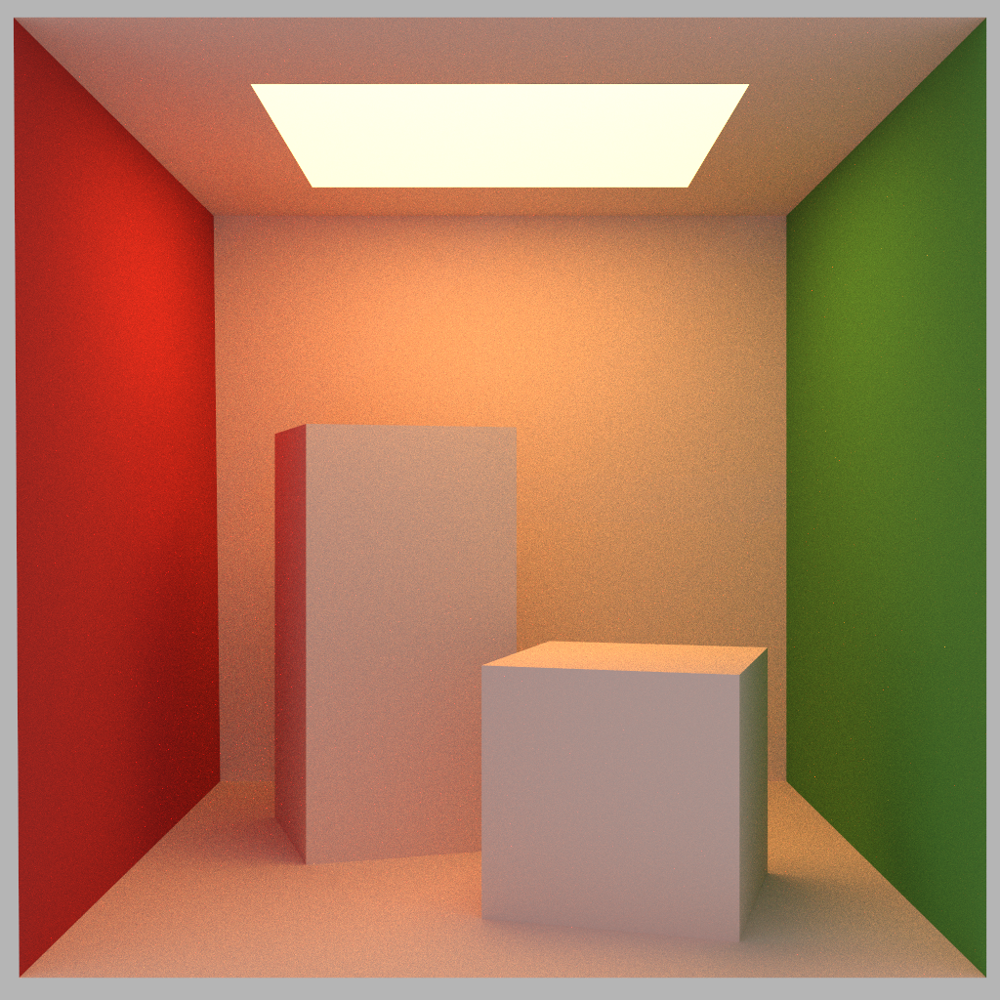
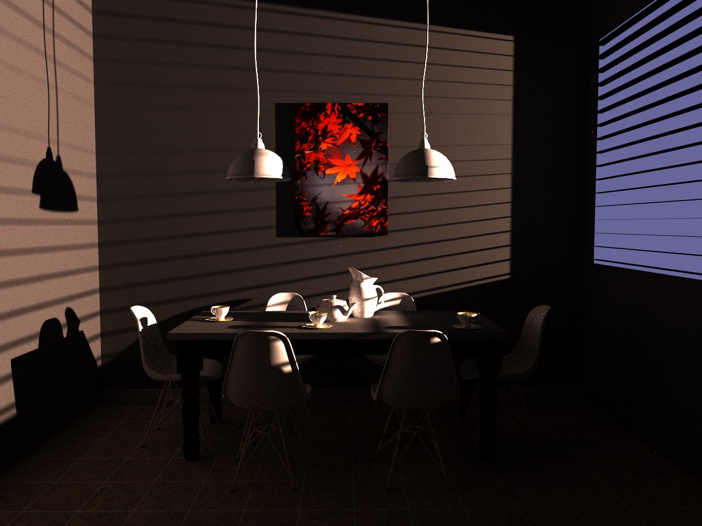
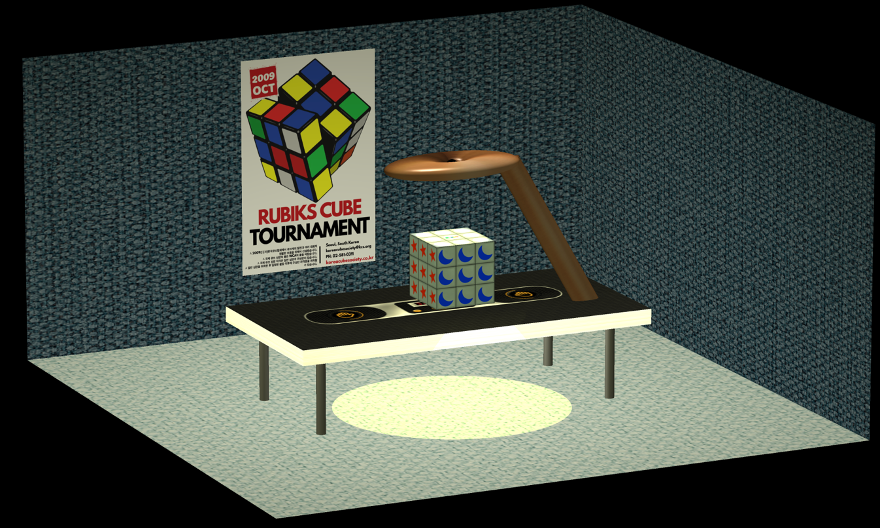

## PathTracer_CUDA
A GPU Path Tracer written in CUDA C++ with BVH acceleration.
- 
- Tags: Category 1
- Badges:
  - CUDA [blue]
  - C++ [blue]
- Buttons:
  - GitHub [https://github.com/jayHuggie/PathTracer_CUDA]

## Physically Based Renderer
Course Project of UCSD CSE 168 (Computer Graphics II: Rendering)
- 
- Tags: Category 2
- Badges:
  - C++ [blue]
- Buttons:
  - GitHub [https://github.com/jayHuggie/PBR]

## Cloth Simulation
A simulation of a cloth using particles, spring-dampers, and triangular surfaces, developed with OpenGL. (Course Project for UCSD CSE 169 - Computer Animation) 
- 
- Tags: Category 3
- Badges:
  - OpenGL [blue]
  - C++ [blue]
- Buttons:
  - GitHub [https://github.com/jayHuggie/Cloth_Simulation]
 
## First OpenGL Project

This was my Final Project for UCSD Math 155A (Geometric Computer Graphics) where I had to design a scene in OpenGL from scratch.
- 
- Tags: Category 4
- Badges:
  - OpenGL [blue]
  - C++ [blue]
- Buttons:
  - GitHub [https://github.com/jayHuggie/Cloth_Simulation]

