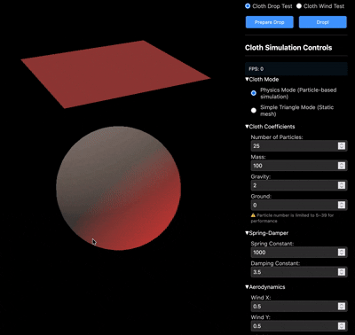
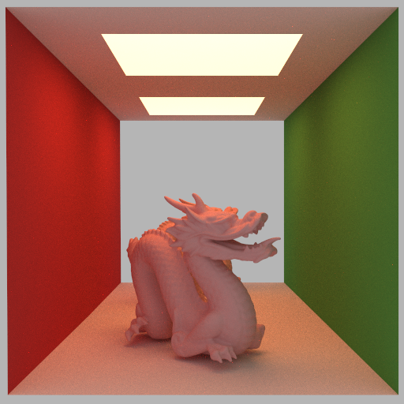
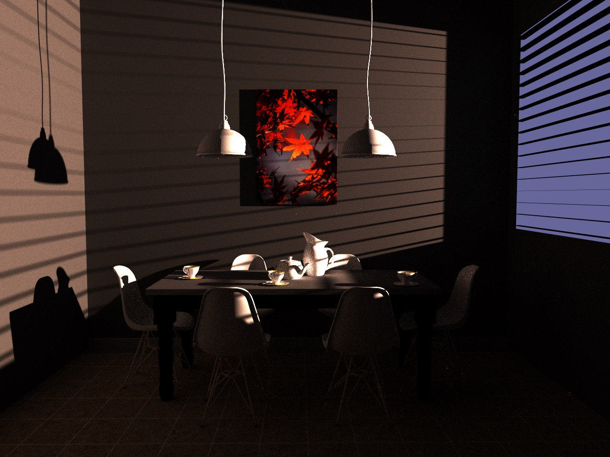
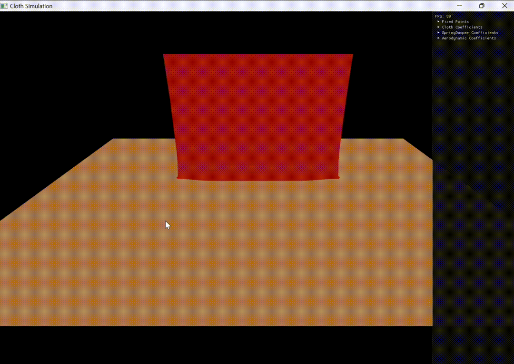
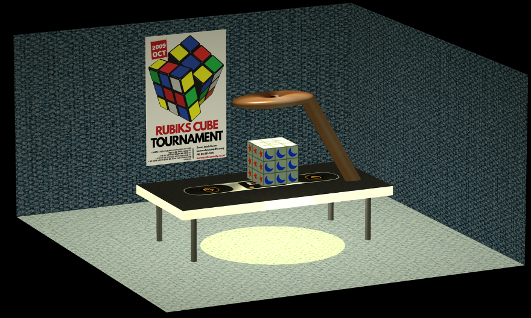

## Interactive PathTracer_CUDA
A real-time GPU Path Tracer in CUDA C++, featuring BVH acceleration, global illumination, and progressive rendering in an interactive OpenGL display.
- 
- Tags: Category 1
- Badges:
  - CUDA [blue]
  - C++ [blue]
  - OpenGL [blue]
- Buttons:
  - GitHub [https://github.com/jayHuggie/PathTracer_CUDA_Interactive]

## Cloth Simulation - WebGPU
A browser-based, real-time WebGPU cloth simulation using adjustable triangle resolution, mass, gravity, springs, damping, wind, and camera controls.
- 
- Tags: Category 1
- Badges:
  - WebGPU [blue]
  - TypeScript [blue]
- Buttons:
  - Try it Yourself! [https://jayhuggie-cloth.netlify.app]
  - GitHub [https://github.com/jayHuggie/Cloth_Simulation_WebGPU]
 
## Ray Tracing in Game Boy Color
A Game Boy Color homebrew ROM that renders a raytraced 3D scene with real-time shading and shadows.
- 
- Tags: Category 1
- Badges:
  - C [blue]
  - GBDK-2020 [blue]
- Buttons:
  - GitHub [https://github.com/jayHuggie/GBC_RayTracer]

## PathTracer_CUDA (2025 Version)
A Fast GPU Path Tracer written in CUDA C++ with BVH acceleration.
- 
- Tags: Category 1
- Badges:
  - CUDA [blue]
  - C++ [blue]
- Buttons:
  - GitHub [https://github.com/jayHuggie/PathTracer_CUDA]

## Physically Based Renderer
Course Project of UCSD CSE 168 (Computer Graphics II: Rendering)
- 
- Tags: Category 2
- Badges:
  - C++ [blue]
- Buttons:
  - GitHub [https://github.com/jayHuggie/PBR]

## Animation with Dynamic Cubemap
A character animation system with skeleton loading, skinning, and keyframe animation. It also includes static and dynamic cubemaps for environment mapping, real-time reflections, and basic Physically Based Rendering (PBR) materials, all developed with OpenGL and GLSL.
- 
- Tags: Category 3
- Badges:
  - OpenGL [blue]
  - GLSL [blue]
  - C++ [blue]
- Buttons:
  - GitHub [https://github.com/jayHuggie/Animation_with_DynamicCubemap]

## Cloth Simulation
A simulation of a cloth using particles, spring-dampers, and triangular surfaces, developed with OpenGL.
- 
- Tags: Category 4
- Badges:
  - OpenGL [blue]
  - C++ [blue]
- Buttons:
  - GitHub [https://github.com/jayHuggie/Cloth_Simulation]

## First OpenGL Project
This was my Final Project for UCSD Math 155A (Geometric Computer Graphics) where I had to design a scene in OpenGL from scratch.
- 
- Tags: Category 5
- Badges:
  - OpenGL [blue]
  - C++ [blue]
- Buttons:
  - GitHub [https://github.com/jayHuggie/First_OpenGL_Project]
